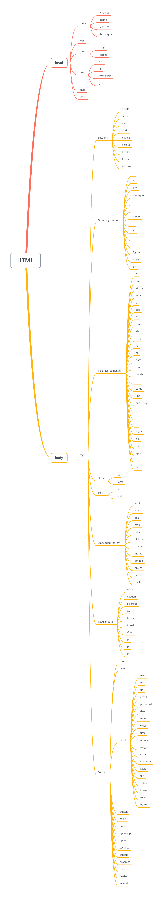

> 作者： Ryan Kong<br>
> 仓库： [GitHub](https://github.com/stormkang)<br>
> 博客： [掘金](https://juejin.im/user/5ca05e1be51d4510864bf059/posts) &nbsp;[GitHub](https://github.com/stormkang/study-blog)<br>
> 联系我： SherKang(微信号)<br>
> 特别声明：原创不易，未经授权不得对此文章进行转载或抄袭，希望各位尊重原创的知识产权

# HTML体系

## html
html元素代表HTML文档的根元素。建议在根html元素上指定lang属性，以提供文档的语言。这有助于语音合成工具确定使用什么发音，翻译工具确定使用什么规则，等等。
```html
<html lang="en">
```

## head
head元素表示文档的元数据集合。
```html
<HEAD>
  <META CHARSET="UTF-8">
  <BASE HREF="https://www.example.com/">
  <TITLE>An application with a long head</TITLE>
  <LINK REL="STYLESHEET" HREF="default.css">
  <LINK REL="STYLESHEET ALTERNATE" HREF="big.css" TITLE="Big Text">
  <SCRIPT SRC="support.js"></SCRIPT>
  <META NAME="APPLICATION-NAME" CONTENT="Long headed application">
 </HEAD>
```

## title
title元素表示文档的标题或名称。应该使用能够识别文档的标题，每个文档必须有一个以上的title元素。
```html
<title>我是标题</title>
```

## base
基本元素允许作者指定用于解析URL的文档基本URL，以及用于跟踪超链接的默认浏览上下文的名称。元素不表示此信息之外的任何内容。

### 属性
- href — 文档基本URL
- target — 超链接导航和表单提交的默认浏览上下文

每个文档必须有一个以上的基本元素。

一个基本元素必须有一个href属性，一个目标属性，或者两者兼而有之。

如果指定了href内容属性，则它必须包含一个可能被空格包围的有效URL。

如果基元素有href属性，那么它必须位于树中定义为获取url的属性的任何其他元素之前，html元素除外(它的manifest属性不受基元素的影响)。
```html
<head>
  <title>This is an example for the &lt;base&gt; element</title>
  <base href="https://www.example.com/news/index.html">
</head>
<body>
    <p>Visit the <a href="archives.html">archives</a>.</p>
</body>
```
上面示例中的链接是指向“https://www.example.com/news/archives.html”的链接。
> 注意： 如果有多个带有href属性的基本元素，则忽略除第一个之外的所有基本元素。

## link
link元素允许作者将文档链接到其他资源。

链接的目的地由href属性提供，该属性必须存在，并且必须包含一个可能被空格包围的有效非空URL。如果href属性不存在，则该元素不定义链接。

crossorigin属性是一个CORS设置属性。它用于与外部资源链接一起使用。

### 属性
- href — 超链接的地址
- crossorigin — 元素如何处理crossorigin请求
- rel — 包含超链接的文档与目标资源之间的关系
- media — 适用媒体
- hreflang — 链接资源的语言
- type — 引用资源类型的提示
- referrerpolicy — R元素发起的获取引用策略
- sizes — 图标的尺寸(rel="icon")
```html
<link rel="author license" href="/about">
```

## meta
meta元素表示不能使用标题、基础、链接、样式和脚本元素表示的各种元数据。

meta元素可以用name属性表示文档级的元数据，用http-equiv属性表示pragma指令，用charset属性表示当HTML文档被序列化为字符串形式(例如，用于网络传输或磁盘存储)时文件的字符编码声明。

必须指定其中一个name，http-equiv、charset和itemprop属性。

如果指定了name、http-equiv或itemprop，则还必须指定内容属性。否则，它必须被省略。

charset属性指定文档使用的字符编码。这是一个字符编码声明。如果属性存在，则其值必须是字符串“utf-8”的不区分大小写的ASCII匹配。

### 属性
- name — 元数据名称
    - author - 该值必须是一个自由格式的字符串，给出页面作者之一的名称。
    - description - 该值必须是描述页面的自由格式字符串。 该值必须适合在页面目录中使用，例如 在搜索引擎中。 每个文档的名称属性值必须是不区分大小写的ASCII ASCII匹配，不得超过一个meta元素。
    - keywords - 该值必须是一组逗号分隔的标记，每个标记都是与页面相关的关键字。
        ```html
        <meta name="keywords" content="british,type face,font,fonts,highway,highways">
        ```
    - referrer - 该值必须是一个引用策略，它定义了文档的默认引用策略。
- content — 元素的值
- http-equiv — Pragma指令
- charset — 字符编码声明

## style
style元素允许作者在文档中嵌入CSS样式表。
```html
<style>
  body { color: black; background: white; }
  em { font-style: normal; color: red; }
</style>
```

## HTML体系结构
