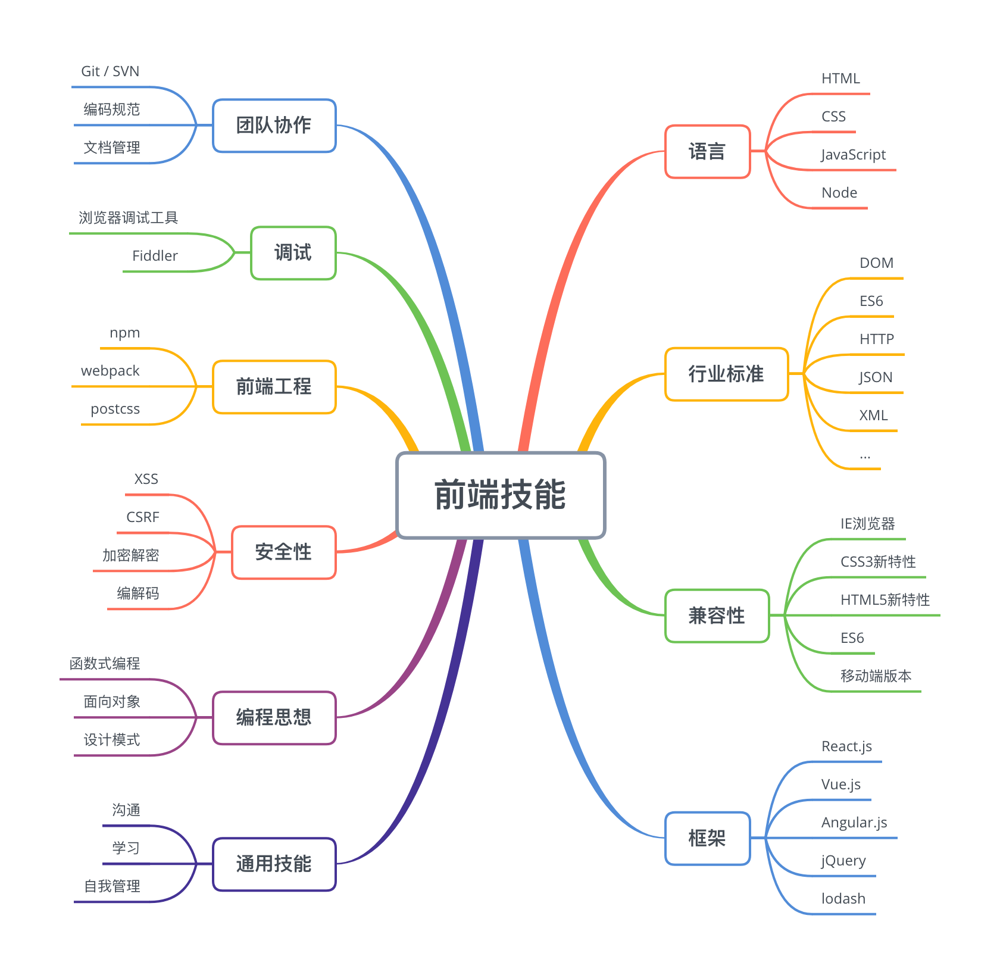

# 前端概论

## 什么是前端?
-  解决GUI人机交互问题
-  跨终端
    - PC/移动浏览器
    - 客户端
    - VR/AR等
- Web技术栈
    - HTML
    - CSS
    - JavaScript
    - HTTP
    - ...

> 一句话总结: 前端技术工程师就是使用Web技术栈, 解决多端的图形界面交互问题的工程师.

## 前端技术栈
前端的技术主要分为三层: 最基础的是HTML, 它负责描述页面的内容和结构. 页面中可以使用CSS来描述页面的样式. 使用JS来定义页面的行为. 以上三层都是运行在浏览器中的, 而浏览器通过HTTP协议和服务器进行通信, 它把前端的这些代码从服务器获取到并渲染到页面, 浏览器也可以把用户填写的内容通过HTTP协议提交到服务器. 那HTML、CSS、JS和HTTP就构成了前端最基础的技术栈.

## 前端应该关注哪些方面

还记得前端要解决的根本问题吗? 就是图形界面下的人机交互问题.

## 前端的边界
新技术不断发展, 现在前端也远远超出了做页面的需求. 比如说我们可以
- 使用Node.js来开发服务端的应用
- 使用Electron或者React Native来开发客户端的应用
- 使用WebRTC进行P2P的数据传输, 来开发多人的视频会议
- 使用WebGL也可以做出来一些比较流畅的大型3D游戏
- 使用WebAssembly可以把C++或者其他的语言编译成浏览器可以运行的程序

## 开发环境

### 编辑器
- VSCode
- Atom
- Sublime
- Webstorm

### 浏览器
- Chrome
- Firefox
- Safari
- IE/Edge

总之, 前端是互联网这个行业发展最快的一个领域, 我们的技术在不断的更新, 我们也要持续的学习才能跟上技术的发展.
