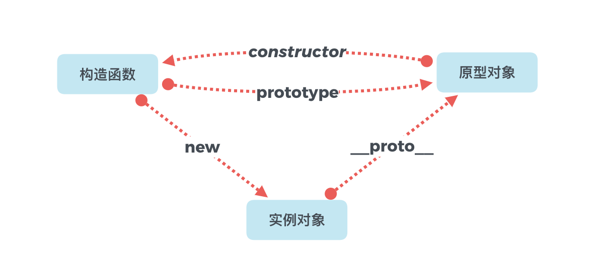

# JS原型链与继承

## 一、原型链
说原型链之前, 要先了解几个概念:

- 构造函数
  用new关键字来调用的函数

- 原型对象
  所有的JavaScript对象都会从一个prototype（原型对象）中继承属性和方法, 原型对象一般用于共享.

- 实例对象
通过new关键字创建的对象

> 构造函数(constructor)通过new关键字创建实例对象(instance), 实例对象通过**.__proto__**找到原型对象(prototype), 原型对象通过**.constructor**找到构造函数, 如此构成一个循环. 构造函数通过**.prototype**也可以找到原型对象.

三者之间的关系如下图:



## 二、继承

### 原生JS实现
```js
function Person(name, age) {
  this.name = name;
  this.age = age;
}

Person.prototype.getName = function() {
  return this.name;
}

function Worker(name, age, work) {
  Person.call(this, name, age);
  // this.name = name;
  // this.age = age;
  this.work = work;
}

Worker.prototype = Object.create(Person.prototype);
// 将Worker的构造器指向自己!
Worker.prototype.constructor = Worker;

const jack = new Worker('jack', 20, 'some work');
console.log(jack);
```

### ES6 Class实现
```js
class Person {
  constructor(name, age) {
    this.name = name;
    this.age = age;
  }

  getName() {
    return this.name;
  }
}

class Worker extends Person {
  constructor(name, age, work) {
    super(name, age);
    this.work = work;
  }
}

const jack = new Worker('jack', 20, 'some work');
console.log(jack);
```
